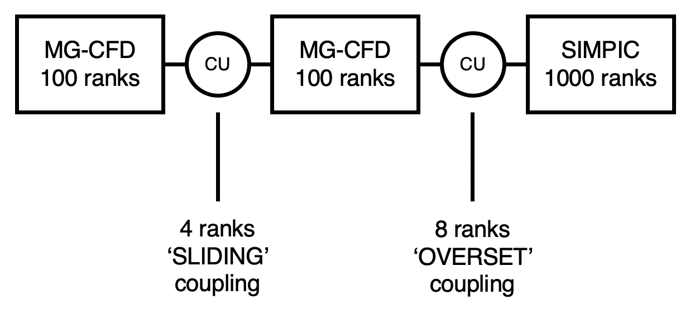

Running
=====

Setup
------------
Before running a simulation, there are a few setup stages to perform:

* Configure the CPX setup file
* Configure the coupling parameters
* Configure the input of the mini-apps

Configuring the CPX setup file
-----------------
The CPX setup file is called 'cpx_input.cfg'. It is used to specify the number of cores to allocate to each mini-app and coupler instance, and to define the setup of the simulation. We will take a look at an example to understand the format:
:: 
   TOTAL 5

   MG-CFD 100
   MG-CFD 100
   SIMPIC 1000

   COUPLER 4
   TYPE SLIDING
   UNIT_1 1
   UNIT_2 2
   
   COUPLER 8
   TYPE OVERSET
   UNIT_1 2
   UNIT_2 3

* The first line must have the keyword 'TOTAL' followed by the total number of instances in the simulation. This value is the sum of the coupler units and mini-app instances. Here, the value is 5, as we are coupling 2 instances of the MG-CFD mini-app, and 1 instance of the SIMPIC mini-app using 2 coupler units.
* The next section defines each of the mini-app instances and the number of MPI ranks associated to each instance. Here we have defined two instances of MG-CFD, each with 100 ranks, and 1 instance of SIMPIC with 1000 ranks.
* The final section defines the coupler units. The first line specifies the number of ranks assocaited with that coupler unit, the second denotes the coupling type, and the third and fourth lines denote which two mini-app units the coupler units are coupling.

This produces the following configuration:

belled, with the first label reading '4 ranks, SLIDING coupling', and the second label reading '8 ranks, OVERSET coupling.
  
Configure the coupling parameters
-----------------
Next to configure are the parameters for the coupling itself. These are set in the 'coupler_config.h' header file in the src_op directory, and are used to set how often the coupling takes place and dictate which optimizations are used. It will look similar to the following:
:: 
   static int coupler_cycles = 5000;
   static int mg_conversion_factor = 10; 
   static int fenics_conversion_factor = 1;
   static int search_freq = 6;
   static int MUM = 1;
   static bool fastsearch = true; 
   static bool ultrafastsearch = true;
   static bool superdebug = false;
   static bool debug = false;
   static bool hide_search = false;
  
* **coupler_cycles** defines the number of communication cycles in the coupler units. In each cycle, an 'interpolation' routine is performed, where the values from a small slice of the two mini-app instances linked are averaged.
* **mg_conversion_factor** is multiplied by coupler_cycles to calculate the number of MG Cycles (MG-CFD iterations) required to match the production application the mini-app is based off. 10 MG Cycles is equivalent to 1 production code iteration.
* **fenics_conversion_factor** is the same as above but for the FEniCS code. As the FEniCS mini-app uses the same framework as the production application, this value is 1.
* **search_freq controls** how often the search routine is ran in MG-CFD when it is coupled with another MG-CFD unit using the 'SLIDING' coupling type. This frequency is set at 6 which mimics the run-time overhead as the production coupled code.
* **MUM**, standing for multi-unit mode, is used to control whether assigning ranks mimics a single coupler unit with multiple ranks or mimics each rank being a coupler unit. For best performance, MUM should be set to 1.
* **fastsearch** controls the algorithm for the search. When it is set to false, a brute force search will be ran. When set to true, a faster tree based search is used.
* **ultrafastsearch** mimics the effect of a cell prediction feature in the production coupler.
* **superdebug** was used in development to disable coupling entirely and allowed mini-apps to run on their own - this is now deprecated
* **debug controls** the amount of output from CPX. Setting the value to true outputs extra information.
* **hide_search** was an experimental feature to overlay the search routine within interpolation routines - this is now deprecated

In general, the only variable worth changing is coupler_cycles, which controls the number of MG-CFD cycles being ran in the simulation.

Configure the input of the mini-apps
-----------------
The last thing to do is to configure the input of the mini-apps themselves.
